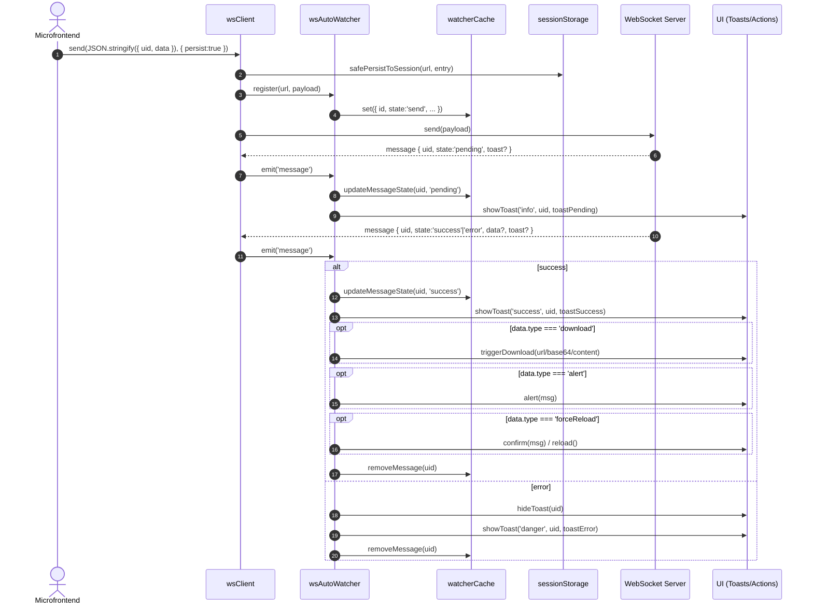
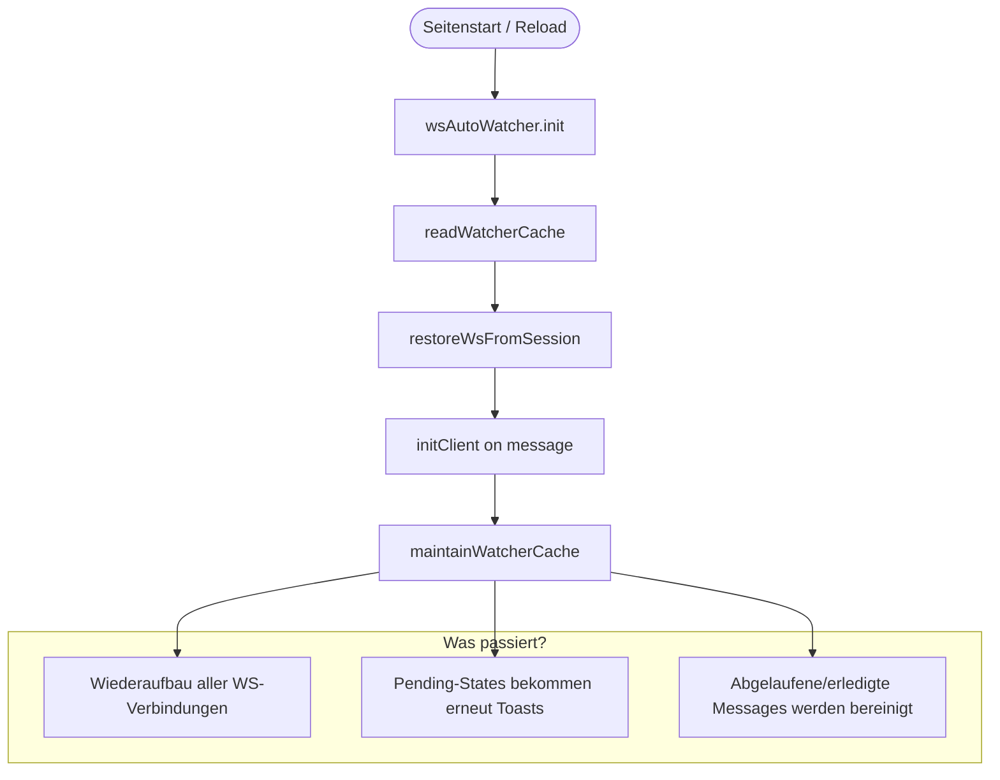

# 🧩 WebSocket Utility – `wsClient` & `wsAutoWatcher`

Ein leichtgewichtiges, modular aufgebautes WebSocket-Framework für Browser-basierte Anwendungen.  
Es bietet persistente Verbindungen, automatisches Reconnect- und Message-Tracking, Toast-Benachrichtigungen, sowie einen Watcher, der über Seitenwechsel hinweg Nachrichten- und Zustände rekonstruiert.

---

## Inhaltsverzeichnis

1. [Überblick](#überblick)  
2. [1️⃣ wsClient](#1️⃣-wsclient)  
   - [Funktionen](#funktionen)  
   - [Beispiel](#beispiel)  
   - [Optionen (`WsServiceOptions`)](#optionen-wsserviceoptions)  
   - [Methodenübersicht](#methodenübersicht)  
3. [2️⃣ wsAutoWatcher](#2️⃣-wsautowatcher)  
   - [Funktionsweise](#funktionsweise)  
   - [Beispielintegration](#beispielintegration)  
   - [Handler-Ablauf](#handler-ablauf)  
   - [Hilfsfunktionen](#hilfsfunktionen)  
4. [Architektur](#architektur)  
5. [Testen & Entwicklung](#testen--entwicklung)

---

## Überblick

Dieses Modul besteht aus zwei zentralen Teilen:

| Komponente | Zweck |
|-------------|-------|
| **`wsClient`** | Verbindet sich zu einem WebSocket-Endpoint, verwaltet Listener, unterstützt persistente Sessions und automatisches Session-Recovery. |
| **`wsAutoWatcher`** | Initialisiert alle gespeicherten WebSocket-Verbindungen erneut, überwacht Nachrichten (pending/success/error), zeigt Toasts an und führt automatisch Aktionen wie Download, Alert oder Force-Reload aus. |

---

## 1️⃣ wsClient

Der `wsClient` ist ein funktionaler WebSocket-Client, der für jede eindeutige URL (inkl. optionalem Token) **singleton-basiert** verwaltet wird.

Er bietet:
- automatische Verbindungsherstellung (ready-Promise)
- Listener-System für `open`, `message`, `close`, `error`
- persistente Speicherung im `sessionStorage` (bei `send(..., {persist:true})`)
- Integration in den `wsAutoWatcher`
- soft/hard Close-Mechanik mit intelligentem Cleanup

---

### Funktionen

```ts
import { wsClient } from '@your-org/ws';
```

```ts
const client = wsClient({
  url: 'wss://api.example.com/realtime',
  authToken: 'abc123',
  appendAuthToQuery: true,
});
```

```ts
await client.ready(); // wartet, bis Verbindung geöffnet ist
client.isOpen();      // true/false
```

---

### Beispiel

```ts
import { wsClient } from '@your-org/ws';

const socket = wsClient({
  url: 'wss://api.example.com/realtime',
  authToken: 'user-token-xyz',
});

// Verbindung aufbauen
await socket.ready();

// Event-Handler registrieren
socket.on('open', () => console.log('[open] connected'));
socket.on('message', (e) => console.log('[msg]', e.data));
socket.on('error', (e) => console.error('[err]', e));
socket.on('close', (e) => console.warn('[closed]', e.reason));

// Nachricht senden (mit persistenter Registrierung)
socket.send(
  JSON.stringify({
    uid: crypto.randomUUID(),
    data: {
      type: 'download',
      sim: { pending: true, outcome: 'success', delayMs: 500 },
    },
  }),
  { persist: true }
);
```

---

### Optionen (`WsServiceOptions`)

| Option | Typ | Beschreibung |
|--------|-----|---------------|
| `url` | `string` | Ziel-URL des WebSockets (Pflicht) |
| `authToken` | `string` | Optionaler Token für Authentifizierung |
| `appendAuthToQuery` | `boolean` | Wenn `true`, wird `?token=...` an URL angehängt |
| `protocols` | `string[]` | Custom-Protocols (optional) |
| `wsImpl` | `WebSocket` | Alternative Implementierung (z. B. für Tests) |

---

### Methodenübersicht

| Methode | Beschreibung |
|----------|---------------|
| **`ready()`** | Promise, das resolved, sobald der Socket offen ist |
| **`send(data, {persist?})`** | Sendet Daten. Optional mit Session-Persistierung |
| **`on(event, cb)` / `off(event, cb)`** | Registriert / entfernt Event-Listener |
| **`close(soft?, code?, reason?)`** | Soft- oder Hard-Close (siehe unten) |
| **`release()`** | Intern von `close(soft)` genutzt – reduziert Ref-Count |
| **`hardClose()`** | Beendet die Verbindung und entfernt alle Listener |
| **`isOpen()`** | Prüft den `readyState` |
| **`socket()`** | Gibt die rohe `WebSocket`-Instanz zurück |

**Soft- vs Hard-Close**

| Modus | Verhalten |
|--------|------------|
| **Soft (`close(true)`)** | Dereferenziert Client, aber Session bleibt erhalten |
| **Hard (`close(false)`)** | Entfernt Session-Eintrag + schließt physisch |

---

## 2️⃣ wsAutoWatcher

Der `wsAutoWatcher` ist das Gegenstück zum Client:  
Er wird typischerweise **einmalig im Header oder Root-Script** initialisiert und sorgt dafür, dass alle bestehenden Sockets & Nachrichten automatisch wiederhergestellt werden.

---

### Funktionsweise

- Liest gespeicherte WebSocket-Sessions aus `sessionStorage`
- Initialisiert sie erneut (über `restoreWsFromSession`)
- Überwacht eingehende Nachrichten
- Erkennt States (`pending`, `success`, `error`)
- Zeigt automatisch passende Toasts an
- Führt im `success`-Fall Aktionen aus:
  - **download** → löst automatisch File-Download aus  
  - **alert** → zeigt Browser-Alert mit übersetztem Text  
  - **forceReload** → fragt Confirm und lädt Seite ggf. neu  
- Entfernt abgeschlossene Nachrichten (success/error) aus Cache

---

### Beispielintegration

```ts
// In deinem globalen Entry (z. B. main.ts oder app-header.ts)
import { wsAutoWatcher } from '@your-org/ws';

const watcher = wsAutoWatcher();
watcher.init();
```

Optional: Zugriff auf Cache-Daten oder manuelles Clearen
```ts
const all = watcher.list();
console.table(all);

watcher.clear(); // löscht alles inkl. sessionStorage
```

---

### Handler-Ablauf

| State | Aktion | Beschreibung |
|--------|---------|--------------|
| `pending` | `handlePending()` | Zeigt Info-Toast |
| `success` | `handleSuccess()` | Zeigt Success-Toast, triggert optional Download / Alert / Reload |
| `error` | `handleError()` | Zeigt Error-Toast und entfernt Eintrag |

Jeder Handler verwendet automatisch den **`translateSafe()`**-Helper, um i18n-Keys in lesbare Texte umzuwandeln.

---

### Hilfsfunktionen

| Helper | Zweck |
|---------|-------|
| `normalizeUrl()` | vereinheitlicht URLs + Token |
| `safePersistToSession()` | schreibt Session-Eintrag sicher |
| `safeRemoveFromSession()` | entfernt Eintrag |
| `safeParse()` | JSON.parse() mit Fallback |
| `writeWatcherCache()` / `readWatcherCache()` | Speichert / lädt den Watcher-Cache |
| `maintainWatcherCache()` | prüft auf abgelaufene oder unvollständige Nachrichten |
| `triggerDownload()` | löst Browser-Download aus (mit Blob oder Direktlink) |
| `guessFilename()` | ermittelt Dateiname anhand von URL oder Timestamp |
| `translateSafe()` | übersetzt Message-Keys, falls nötig |
| `toastFactory()` | steuert UI-Toasts (`add`, `hide`, `remove`) |

---

## Architektur

```
┌─────────────────────┐
│   wsAutoWatcher()   │
│   (global init)     │
│ ┌─────────────────┐ │
│ │ watcherCache    │ │
│ │ (Map<id,msg>)   │ │
│ └─────────────────┘ │
│     ▲         │
│     │ restore │
│     │         ▼
│ ┌─────────────────┐
│ │ wsClient()      │
│ │  ├─ send()      │───► Persistiert Nachricht
│ │  ├─ ready()     │
│ │  ├─ close()     │
│ │  └─ on/off()    │
│ └─────────────────┘
│     │
│     ▼
│  Server (WS)
└─────────────────────┘
```

### Übersicht

```mermaid
flowchart LR
  subgraph App [Host-App / Shell]
    H[Header / Boot]
    MF1[Microfrontend A]
    MF2[Microfrontend B]
  end

  subgraph Storage [Browser Storage]
    SS[(sessionStorage)]
  end

  subgraph WSLayer [WS-Layer]
    WSC["wsClient"]
    WAW["wsAutoWatcher"]
    WC["watcherCache (Map)"]
  end

  subgraph Backend [Server]
    S[(WebSocket Endpoint)]
  end

  H -->|"init()"| WAW
  WAW -->|"readWatcherCache()"| SS
  WAW -->|"restoreWsFromSession()"| WSC
  WAW -->|"initClient()"| WSC
  WAW <-->|"maintainWatcherCache()"| WC

  MF1 -->|"send(..., {persist})"| WSC
  MF2 -->|"send(..., {persist})"| WSC
  WSC -->|"safePersistToSession()"| SS
  WSC -->|"register(payload)"| WAW
  WSC <-->|"open/message/close/error"| S

  S -->|"message: pending/success/error"| WSC
  WSC -->|"emit('message')"| WAW
  WAW -->|"updateMessageState()"| WC
  WAW -->|"handlePending/Success/Error"| "UI[Toasts / Actions]"
  UI -->|"download/alert/forceReload"| "User[User]"
```

### Message-Lifecycle (Sequenzdiagramm)



### Rehydration (Seitenwechsel/Reload)




---

## Testen & Entwicklung
Playground
```bash
npm install
npm start
```
Unittests
```bash
npm install
npm test
```

**Vitest + happy-dom** simulieren den Browser-Kontext (inkl. `sessionStorage`, `document`, etc.).

- Alle Helper-Funktionen sind einzeln unit-getestet  
- `wsClient` und `wsAutoWatcher` besitzen umfassende Tests mit Mock-Sockets  
- `server.js` (lokal) kann genutzt werden, um echte End-to-End-Flows zu simulieren

```bash
node server.js
# → HTTP: http://localhost:8080
# → WS:   ws://localhost:8080/realtime
```

**Lokales Frontend-Playground-Beispiel:**  
```html
<ep-playground></ep-playground>
```
ermöglicht Tests mit `pending`, `success`, `error`, `download`, `alert`, `forceReload` direkt im Browser-UI.

---

## Fazit

Mit dieser Architektur erhältst du:
- 💡 stabile WebSocket-Connections
- 💾 automatische Sitzungswiederherstellung
- 🧠 semantisches State-Handling
- 🔔 UI-Feedback durch Toasts
- 🧰 klar strukturierte, testbare Hilfsfunktionen

Ideal für **Microfrontends** oder **Single-Page-Apps**, die persistente, wiederverwendbare Echtzeitverbindungen benötigen – **ohne externe Abhängigkeiten**.